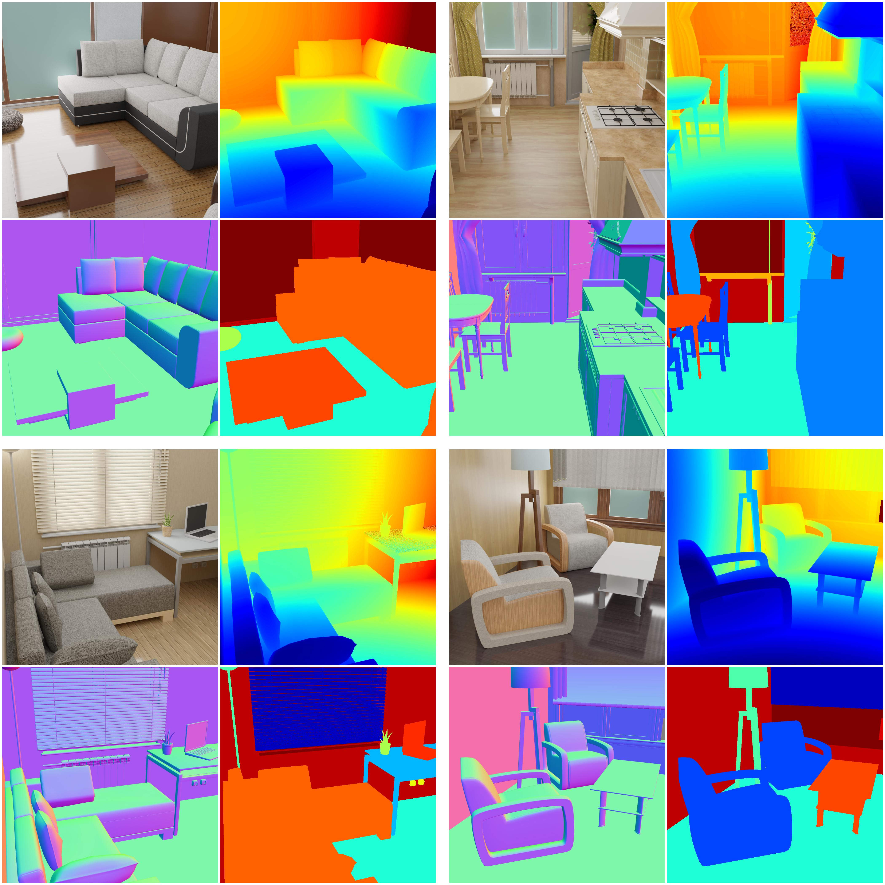

# BlenderProc + Mitsuba2 Rendering

[](https://dlr-rm.github.io/BlenderProc/)
[](https://colab.research.google.com/github/DLR-RM/BlenderProc/blob/main/examples/basics/basic/basic_example.ipynb)
[](https://www.gnu.org/licenses/gpl-3.0)

<p align="center">

</p>

This repo combines the two tools BlenderProc and Mitsuba2 renderer to generate
high quality images. The scenes are created from Blender files and then exported to
a Mitsuba2 .xml format. From there, the files are rendered using the mistuba2 enginge
in the desired mode and saved.

This project is part of the Master Thesis for generating polarized images with Mitsuba2
and using BlenderProc to get the annotations of those images. This enables us to have 
a tool for Object Detection/Pose estimation in which we can customize our dataset by creating the 
objects we want, and then using the Mitsuba2 engine to render them in a more realistic
and customizable way than Blender offers.

## Installation
For installing this pipeline, you will need certain programs and tools installed.
First, it is assumed that you have Python>=3.7 installed and in path in your system.
The list of requirements is long and wont be written here, but in general it is the same
as the combined requirements of blender_proc and Mitsuba2.

Please note that for the correct running of this repo, the same Python enviroment needs
to be used for running all the commands and installing Mitsuba2. For our experiments, 
we used a conda virtual enviroment which has all the packages from blender and Mitsuba2.

### Blender proc
For blender proc you will only need a running version of Python installed on your
machine. Additionally, for generating the linemod dataset, you will need the bop_toolkit
and the files from the linemod dataset. You will find more information on the readme of the folder
from linemod on this repo.

To install all the basic requirements, just clone this repo and run this command:

```
python run.py examples/basics/basic/config.yaml examples/resources/camera_positions examples/resources/scene.obj examples/basics/basic/output
```
This is the basic scene command and will install all the requirements on your machine, inlcuding
blender and all the necessary Python packages. If the images are rendered correctly,
you have succesfully setup blender_proc on your machine.

### Mitsuba2
Installing Mitsuba2 is a bit more complex as the programm is still in development.
As the guide gets updated regularly and changes, please refer to the [Mitsuba2 documentation](https://mitsuba2.readthedocs.io/en/latest/)
for installing and compiling Mitsuba2. Please note as stated before, that you need to use the same
active python enviroment for compiling the system.

For testing purposes, you may test if the programm works with the provided Mitsuba2 xml scenes.
Once is set up, you can find in the Mitsuba2 folder inside this repo the ```material-testball``` folder and scene
for generating the images. If all works correctly, you have succesfully installed Mitsuba2 and blender_proc
on your machine.

## User Guide

For using this pipeline, first we will generate the images and annotations with blender_proc,
then export the blender file to a ```Mitsuba2.xml``` scene format, and finally render the images using
the Mitsuba2 enginge. Please note that the pipeline is not fully automated due to restrictions
coming from both the Mitsuba2 exporter and blender, so you will need to do some manual work.

First running the necessary blender_proc file. For that you will need to run a standard blender_proc
command as the following:
```shell
python run.py config.yaml <additional arguments>
```
In the config file, it is important that you include the custom Module ```ObjWriter```  for exporting
that file to a .blend file

Once you have the rendered images and the ```.blend``` file, you need to open it with blender
and export it to a Mitsuba2 format using the Mitsuba2blender export, which is already installed
in this repo. Once written, you have now a ```.xml``` scene file which you can use for rendering the images.

For rendering polarized images, you will need to create two ```scene.xml``` files similar to the ones
you find in the ```material-testball``` folder. One serves the purpose for the 4 filtered
images and the other for all the stokes parameters.
Once you have that, you can just execute the main programm inside the Mitsuba2 folder 
in this repo and you will have all the generated images.

## Citation

```
@article{denninger2019blenderproc,
  title={BlenderProc},
  author={Denninger, Maximilian and Sundermeyer, Martin and Winkelbauer, Dominik and Zidan, Youssef and Olefir, Dmitry and Elbadrawy, Mohamad and Lodhi, Ahsan and Katam, Harinandan},
  journal={arXiv preprint arXiv:1911.01911},
  year={2019}
}
```

---

<div align="center">
  <a href="https://www.dlr.de/EN/Home/home_node.html"></a>
</div>
