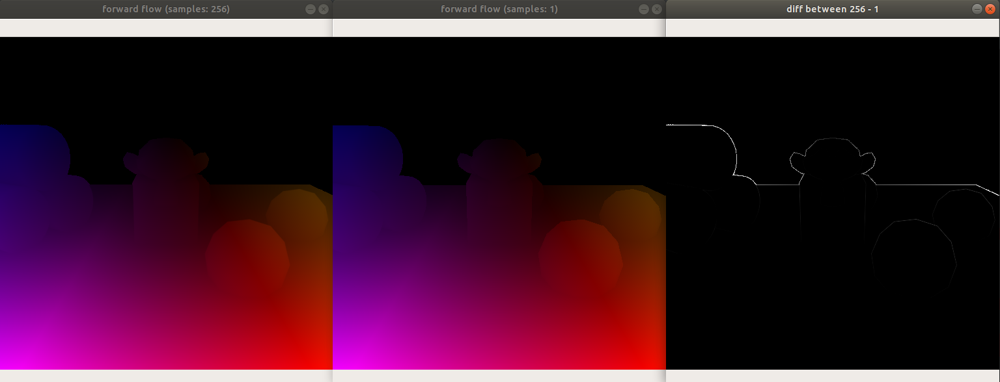
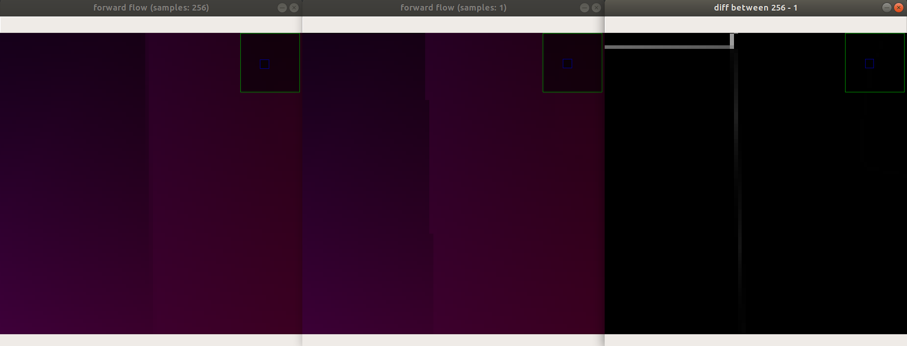

# Optical Flow


_First row: RGB images, second row: forward optical flow generated by Blender, third row: forward optical flow from a pretrained [LiteFlowNet](http://mmlab.ie.cuhk.edu.hk/projects/LiteFlowNet/) as comparison_


In this example we demonstrate how to obtain forward / backward flow values between consecutive key frames. 

Flow is visible if either the camera or objects move between frames. Here, the camera undergoes the following motion:
```yaml
0 -10 4 1.3 0 0  # initial position
0 -12 4 1.3 0 0  # moving away from object
2 -12 4 1.3 0 0  # moving to the right
2 -12 6 1.3 0 0  # moving upwards
1 -11 5 1.3 0 0  # combined motion (to the left, towards object and downwards)
```

## Usage

Execute in the BlenderProc main directory:

```
python run.py examples/advanced/optical_flow/config.yaml examples/advanced/optical_flow/camera_positions examples/resources/scene.obj examples/advanced/optical_flow/output
```

* `examples/advanced/optical_flow/config.yaml`: path to the configuration file with pipeline configuration.
* `examples/advanced/optical_flow/camera_positions`: text file with parameters of camera positions.
* `examples/resources/scene.obj`: path to the object file with the basic scene.
* `examples/advanced/optical_flow/output`: path to the output directory.

## Visualization

Visualize the generated data:

```
python scripts/visHdf5Files.py examples/advanced/optical_flow/output/1.hdf5
```

## Steps

* Loads `scene.obj`: `loader.ObjectLoader` module.
* Creates a point light : `lighting.LightLoader` module.
* Loads camera positions from `camera_positions`: `camera.CameraLoader` module.
* Renders rgb: `renderer.RgbRenderer` module.
* Renders forward / backward optical flow: `renderer.FlowRenderer` module.
* Writes the output to .hdf5 containers: `writer.Hdf5Writer` module.

## Config file

### FlowRenderer

```yaml
{
  "module": "renderer.FlowRenderer",
  "config": {
      "forward_flow_output_key": "forward_flow",
      "backward_flow_output_key": "backward_flow",
      "forward_flow": True,
      "backward_flow": True,
      "blender_image_coordinate_style": False
  }
}
```

* This module just goes through all cam poses which were defined in the previous model and renders forward and / or backward flow
* The images are rendered using the `.exr` format which allows linear colorspace and higher precision, and then converted to numpy.float32 arrays
* The output files are stored in the defined output directory (see [Global](#Global)) and, per default, are named like `{forward_flow, backward_flow}_i.npy` where `i` is the cam pose index
* The `output_key` config is relevant for the last module, as it defines the key at which the normal rendering should be stored inside the `.hdf5` files.
* Per default, Blender uses the bottom left corner as coordinate system origin. OpenCV and popular Flow datasets use the upper left corner instead - change the flag `"blender_image_coordinate_style": True` if you want the default Blender behaviour. Note that the colors in the visualization will be different!

=> Creates the files `forward_flow_000{0, 1, 2, 3, 4}.npy` and / or `backward_flow_000{0, 1, 2, 3, 4}.npy`.

The number of samples is set to `samples = 1` in `src.renderer.FlowRenderer.py` per default. Note that for a sample value > 1 the resulting optical flow map is smoother, especially at border regions. There, the optical flow value might not represent the actual value of the pixel in motion. The below image compares 256 samples (left) with 1 sample (middle) and displays a normalized difference (right):



Zoomed version:



Following this argumentation we suggest using the default setting.
